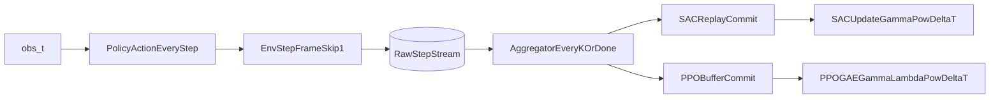

# Decouple control and sampling frequency

## Goal-aligned design

Use `frame_skip=1` always at the environment layer, and introduce a new parameter (e.g. `sample_every`) that controls **how often transitions are committed to learning** while the policy still outputs actions every env step.

This changes the manipulated variable from “action repetition” to “learning data sampling frequency”, which matches the repository’s core question.

## Core implementation changes

- **Config/API rename and semantics**
  - In [metaworld_rl/config.py](/home/ayush/Desktop/tutorials/metaworld_rl/metaworld_rl/config.py), deprecate/remove `env.frame_skip` and add a training-side parameter (e.g. `train.sample_every: int = 1`), plus optional `aggregate_mode` (`sum_rewards`, fixed-length k).
  - Keep `target_simulator_timesteps` as the run budget; do not divide control loop timesteps by `sample_every` anymore.
- **Environment construction**
  - In [metaworld_rl/env/factory.py](/home/ayush/Desktop/tutorials/metaworld_rl/metaworld_rl/env/factory.py), archive `VectorFrameSkip` application.
  - In [metaworld_rl/env/wrappers.py](/home/ayush/Desktop/tutorials/metaworld_rl/metaworld_rl/env/wrappers.py), archive `VectorFrameSkip` to avoid accidental reuse.
- **Trainer sampling pipeline**
  - In [metaworld_rl/trainer.py](/home/ayush/Desktop/tutorials/metaworld_rl/metaworld_rl/trainer.py), keep stepping env every control step (`sample_every` does not affect `env.step` cadence).
  - Add per-env accumulators that:
    - hold last committed observation/action,
    - accumulate reward over `k=sample_every` raw steps,
    - commit one aggregated transition every `k` steps (or earlier on `done`).
  - Track `global_sim_step` (raw control steps) separately from `global_sample_step` (committed learner transitions).

## Algorithm-specific correctness

- **SAC (off-policy)**
  - Store aggregated transitions in replay buffer at commit points only.
  - Use effective discount per transition: `gamma_eff = gamma ** delta_t` where `delta_t` is aggregated raw-step span (normally `k`, shorter at episode end).
  - Keep update-count policy explicit: either updates per simulator step or per committed sample (choose one and log it clearly).
- **PPO (on-policy)**
  - Build rollouts from aggregated decision-to-decision transitions, not every raw env step.
  - For each stored transition span `delta_t`, compute return/GAE using `gamma ** delta_t` and `lambda ** delta_t`.
  - Interpret `ppo.n_steps` as **number of committed samples per env**; raw simulator steps per PPO update become approximately `n_steps * sample_every`.

## Logging/CLI/experiment hygiene

- In [scripts/train.py](/home/ayush/Desktop/tutorials/metaworld_rl/scripts/train.py), replace `--frame-skip` with `--sample-every`; update run naming tags from `fs...` to `se...`.
- Update [configs/default.yaml](/home/ayush/Desktop/tutorials/metaworld_rl/configs/default.yaml) and [README.md](/home/ayush/Desktop/tutorials/metaworld_rl/README.md) to reflect new semantics and expected invariants.
- Update sweep/plot scripts (e.g. [scripts/visualize_sac_ablation_wandb_6x3.py](/home/ayush/Desktop/tutorials/metaworld_rl/scripts/visualize_sac_ablation_wandb_6x3.py)) to group by `sample_every` instead of `frame_skip`.
- Update plotting to wandb such that it is possible to plot rewards and success rate over timesteps instead of over episodes.

## Validation strategy

- Unit-level sanity checks:
  - `sample_every=1` reproduces previous baseline curves/metrics behavior.
  - Episode-end flush works when episode length is not divisible by `sample_every`.
  - Discount exponenting uses actual `delta_t` at truncation/termination.
  - Number of backpropgation updates is held constant despite `sample_every`.
- Behavioral checks:
  - Control/action rate remains unchanged across `sample_every` values.
  - Committed transition count scales ~inverse with `sample_every`.
  - Performance differences can be attributed to data sampling frequency, not reduced actuation fidelity.

## Data-flow sketch

